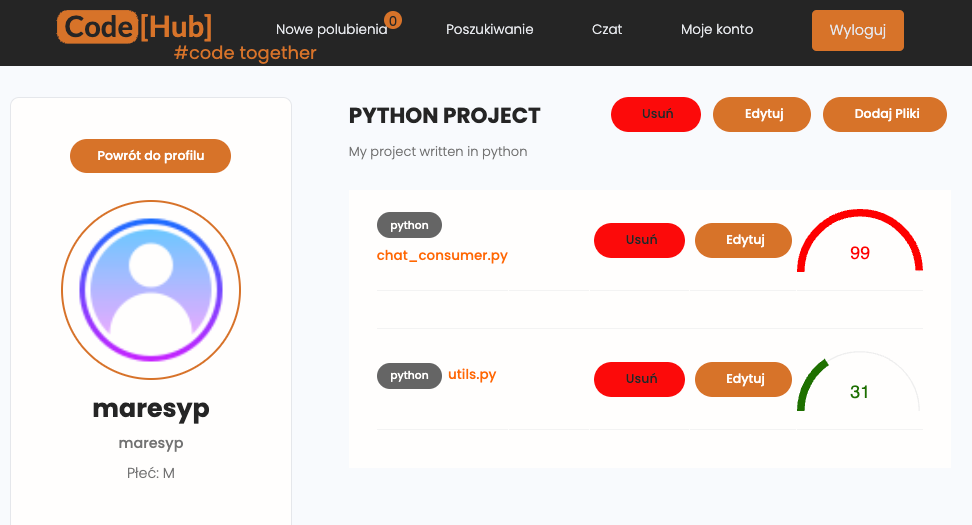

# CodeHub

Social networking service aimed towards people from IT. You can create an account
where you showcase Your programming projects and meet with new people using
matchmaking based on Your preferences. Uploaded code is checked for plagiarism by custom
written algorithm. You can also chat with people or give them a call.  

Technologies used: Django, SQL, HTML, CSS, JavaScript, WebSockets, WebRTC
  
  
  

